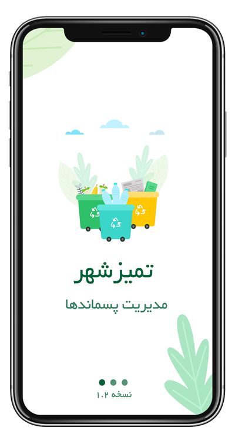

# 🌱 RecycleOrigin

[](https://flutter.dev/)
[](https://dart.dev/)
[](LICENSE)
[](pubspec.yaml)

> **Revolutionizing Waste Management Through Smart Technology**

RecycleOrigin is a comprehensive Flutter-based mobile application designed to facilitate automatic recyclable material collection and management. This innovative platform connects users, drivers, and storekeepers in a seamless ecosystem for sustainable waste management.



## 🚀 Features

### 🔄 Core Functionality
- **Smart Waste Collection**: Schedule and manage recyclable material pickups
- **Real-time Tracking**: Live location tracking with Google Maps integration
- **Multi-User Platform**: Dedicated interfaces for users, drivers, and storekeepers
- **Digital Wallet**: Integrated payment and reward system
- **Charity Integration**: Direct donation system for environmental causes

### 🛍️ E-commerce Features
- **Recycled Products Store**: Purchase eco-friendly products
- **Shopping Cart**: Seamless shopping experience
- **Order Management**: Track orders and delivery status
- **Product Catalog**: Browse sustainable products

### 📱 User Experience
- **Multi-language Support**: Internationalization with Persian and English
- **Push Notifications**: Real-time updates and alerts
- **User Profiles**: Personalized experience with profile management
- **Messaging System**: Direct communication with support team

### 🗺️ Location Services
- **GPS Integration**: Precise location services
- **Map Visualization**: Interactive maps for pickup scheduling
- **Address Management**: Save and manage multiple addresses
- **Route Optimization**: Efficient pickup route planning

## 🛠️ Technology Stack

### Frontend
- **Framework**: Flutter 3.16.0
- **Language**: Dart 3.1.3
- **State Management**: Provider Pattern
- **UI Components**: Material Design 3
- **Maps**: Google Maps Flutter
- **HTTP Client**: Dio & HTTP packages

### Backend Integration
- **API Communication**: RESTful APIs with Dio
- **Local Storage**: Shared Preferences
- **Authentication**: Secure user authentication system
- **Real-time Updates**: WebSocket integration

### External Services
- **Maps**: Google Maps API
- **Geolocation**: Geolocator package
- **Fonts**: Google Fonts & Custom Persian fonts
- **Animations**: Loading animations and smooth transitions

## 📱 Screenshots

<div style="display: flex; gap: 10px; flex-wrap: wrap;">
  
  
  
</div>

## 🚀 Getting Started

### Prerequisites
- Flutter SDK (>=3.1.3)
- Dart SDK (>=3.1.3)
- Android Studio / VS Code
- Git

### Installation

1. **Clone the repository**
   ```bash
   git clone https://github.com/yourusername/recycleorigin.git
   cd recycleorigin
   ```

2. **Install dependencies**
   ```bash
   flutter pub get
   ```

3. **Configure environment**
   - Add your Google Maps API key to `android/app/src/main/AndroidManifest.xml`
   - Configure backend API endpoints in the app configuration

4. **Run the application**
   ```bash
   flutter run
   ```

### Environment Setup

Create a `.env` file in the root directory:
```env
GOOGLE_MAPS_API_KEY=your_google_maps_api_key
API_BASE_URL=your_backend_api_url
```

## 📁 Project Structure

```
lib/
├── core/                    # Core utilities and constants
├── features/               # Feature-based modules
│   ├── home_feature/      # Home screen and dashboard
│   ├── waste_feature/     # Waste collection management
│   ├── store_feature/     # E-commerce functionality
│   ├── customer_feature/  # User authentication and profiles
│   ├── wallet_feature/    # Payment and wallet system
│   ├── Charities/         # Charity and donation features
│   ├── articles_feature/  # News and articles
│   └── ...
├── l10n/                  # Localization files
└── main.dart             # Application entry point
```

## 🌐 Multi-Language Support

The application supports multiple languages with a focus on Persian (Farsi) and English:
- **Persian Fonts**: Custom IRANSans fonts for optimal Persian text rendering
- **RTL Support**: Right-to-left layout support
- **Localization**: Comprehensive i18n implementation

## 🔧 Configuration

### Google Maps Setup
1. Obtain a Google Maps API key from [Google Cloud Console](https://console.cloud.google.com/)
2. Enable Maps SDK for Android and iOS
3. Add the API key to your configuration files

### Backend Integration
The app connects to a comprehensive backend system that includes:
- User management and authentication
- Order processing and tracking
- Payment processing
- Real-time notifications
- Analytics and reporting

## 📊 Key Features Breakdown

### Waste Management
- **Smart Scheduling**: Schedule pickups based on availability
- **Material Classification**: Automatic categorization of recyclables
- **Volume Tracking**: Monitor collection amounts and statistics
- **Environmental Impact**: Track carbon footprint reduction

### E-commerce Platform
- **Sustainable Products**: Curated selection of eco-friendly items
- **Reward System**: Earn points for recycling activities
- **Secure Payments**: Multiple payment options
- **Order Tracking**: Real-time delivery status

### Community Features
- **Charity Donations**: Direct contribution to environmental causes
- **Educational Content**: Articles and guides on sustainability
- **Community Engagement**: Connect with like-minded individuals
- **Impact Visualization**: See collective environmental impact

## 🤝 Contributing

We welcome contributions to make RecycleOrigin even better! Please read our contributing guidelines before submitting pull requests.

### Development Setup
1. Fork the repository
2. Create a feature branch (`git checkout -b feature/amazing-feature`)
3. Commit your changes (`git commit -m 'Add amazing feature'`)
4. Push to the branch (`git push origin feature/amazing-feature`)
5. Open a Pull Request

## 📄 License

This project is licensed under the MIT License - see the [LICENSE](LICENSE) file for details.

## 🌍 Environmental Impact

RecycleOrigin is committed to environmental sustainability:
- **Carbon Footprint Reduction**: Track and visualize environmental impact
- **Waste Diversion**: Help divert waste from landfills
- **Circular Economy**: Promote sustainable consumption patterns
- **Community Awareness**: Educate users about environmental responsibility

## 📞 Support

- **Website**: [https://recycleorigin.com/](https://recycleorigin.com/)
- **Email**: support@recycleorigin.com
- **Documentation**: [Project Wiki](https://github.com/yourusername/recycleorigin/wiki)

## 🙏 Acknowledgments

- Flutter team for the amazing framework
- Google Maps for location services
- All contributors and beta testers
- Environmental organizations supporting our mission

---

<div align="center">
  <p>Made with ❤️ for a sustainable future</p>
  <p>🌱 RecycleOrigin - Transforming waste into opportunity</p>
</div>

